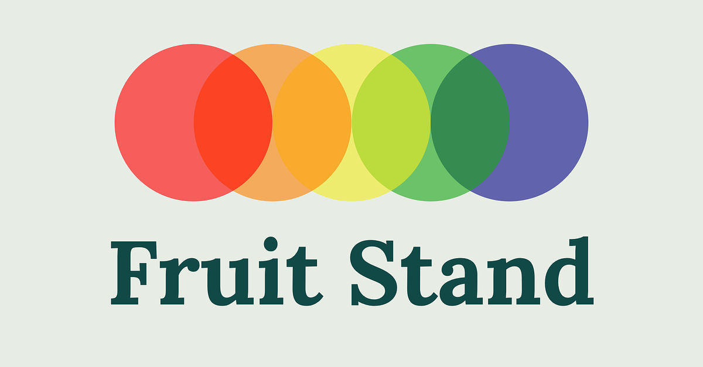

# Fruit Stand

**Fresh data, delivered daily.**

Fruit Stand delivers high-quality, analytics-ready datasets straight into your
Snowflake account — no pipelines to build, no infrastructure to maintain.
Grab a basket, add a listing, and start querying.

<a href="https://app.snowflake.com/marketplace/listing/GZTYZ40XYU5">Try for Free on the Snowflake Marketplace →</a>

## What we offer

- **[FRED Series](datasets/fred-series.mdx)** — the full universe of Federal
  Reserve Economic Data (rates, prices, employment, GDP, housing, and more),
  continuously ingested, historically complete, and refreshed daily.
- **[Earnings Call Transcripts](datasets/earnings-call-transcripts.mdx)** —
  verbatim quarterly earnings call transcripts for 4,500+ public companies,
  2005 to present, split by speaker and paragraph.

Every dataset is standardized into analytics-ready tables with automated
quality checks (row parity, lineage, merge validation), so you can query,
join, and build dashboards immediately instead of maintaining your own
ingestion pipelines.

## Why Fruit Stand

- **Speed to insight** — skip the weeks or months of pipeline engineering and
  start analyzing on day one.
- **Complete coverage** — full history, not a partial backfill.
- **Always fresh** — daily and weekly refreshes keep your data current.
- **Built for Snowflake** — no ETL, no API limits or throttling to manage.